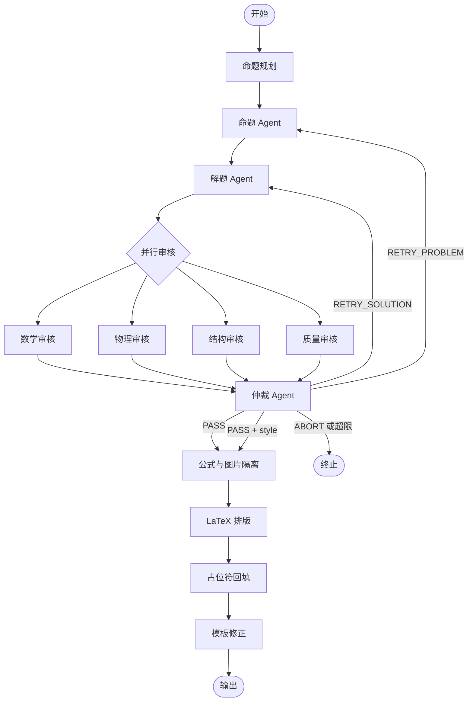

# 开发指南

本文档描述 AI_Question 当前主干上的工作流、状态数据、LLM 客户端、LaTeX 后处理和配置项。内容以维护者开发为目标，避免记录已经移除的历史接口。

## 工作流



核心入口是 `engine.state_machine.GenerationStateMachine`。状态机按以下阶段运行：

```text
INIT -> PLANNING -> PROBLEM_GENERATING -> SOLUTION_GENERATING
     -> REVIEWING -> ARBITRATING
     -> FORMATTING -> TEMPLATE_FIXING -> DONE
```

任一阶段抛出异常时，状态机进入 `ERROR`。仲裁返回 `ABORT` 时，状态机进入 `ABORTED`。

## 节点职责

| 节点 | 实现位置 | 职责 |
| --- | --- | --- |
| 命题规划 | `spec.planner` | 根据输入主题、难度和总分生成规划笔记 |
| 命题 Agent | `agents.problem_generator` | 生成题干、标题和小问结构 |
| 解题 Agent | `agents.solution_generator` | 生成参考答案、评分点和可选图片说明 |
| 数学审核 | `agents.reviewers` | 检查数学推导、符号定义和计算一致性 |
| 物理审核 | `agents.reviewers` | 检查物理模型、边界条件和量纲一致性 |
| 结构审核 | `agents.reviewers` | 通过规则检查编号、分值和公式标签 |
| 质量审核 | `agents.reviewers` | 检查 CPHOS 联考试题深度、梯度和可评分性 |
| 仲裁 Agent | `agents.arbiter` | 汇总审核结果，输出结构化裁决 |
| 隔离器 | `latex.isolate` | 提取标题、公式和图片占位符 |
| 格式化 Agent | `latex.format` | 在不接触原始公式的前提下生成 CPHOS LaTeX 结构 |
| 回填器 | `latex.merge` | 回填公式、图片、引用、小问命令和总分 |
| 模板修正 | `latex.template_agent` | 检查并修复文档类、环境闭合和必要命令 |

## 仲裁语义

仲裁输出由 `model.schema.ArbiterDecision` 校验，字段为：

| 字段 | 合法值 |
| --- | --- |
| `decision` | `PASS`、`RETRY_PROBLEM`、`RETRY_SOLUTION`、`ABORT` |
| `error_category` | `none`、`style`、`fatal` |

合法组合如下：

| 组合 | 路由 |
| --- | --- |
| `PASS + none` | 进入 LaTeX 后处理 |
| `PASS + style` | 映射为 `PASS_WITH_EDITS` 后进入 LaTeX 后处理 |
| `RETRY_PROBLEM + fatal` | 回到命题 Agent，并递增 `problem_retry_count` |
| `RETRY_SOLUTION + fatal` | 回到解题 Agent，并递增 `solution_retry_count` |
| `ABORT + fatal` | 终止当前流程 |

其他组合会在 schema 层被拒绝。路由层仍保留同样的防御校验，用于处理运行期状态被外部代码修改或旧状态恢复的场景。

当仲裁模型返回非法结构化字段时，`agents.arbiter` 会把非法载荷和校验错误追加给仲裁模型，要求其重新调用 `arbiter_decision` 工具。二次校验仍失败时，流程返回 `ABORT + fatal`。

## 重试计数

系统使用分阶段重试计数：

| 字段 | 含义 |
| --- | --- |
| `problem_retry_count` | `RETRY_PROBLEM` 的累计次数 |
| `solution_retry_count` | `RETRY_SOLUTION` 的累计次数 |
| `retry_count` | 两个阶段重试次数之和 |

单阶段达到 `MAX_RETRY_COUNT` 时终止当前题目；总重试次数达到 `2 * MAX_RETRY_COUNT` 时也终止当前题目。`PASS` 和 `ABORT` 不增加重试计数。

## 状态数据

`model.state.WorkflowData` 是状态机内部流转字典的类型视图，由多个阶段记录合并而成：

| 类型 | 写入来源 | 字段 |
| --- | --- | --- |
| `TaskInput` | `spec.normalizer`、`spec.planner` | `mode`、`topic`、`source_material`、`difficulty`、`total_score`、`difficulty_profile`、`planning_notes` |
| `GenerationOutput` | `agents.problem_generator`、`agents.solution_generator` | `title`、`problem_text`、`solution_text`、`draft_content` |
| `ReviewOutput` | `agents.reviewers` | `math_review`、`physics_review`、`structure_review`、`quality_review` |
| `ArbitrationOutput` | `agents.arbiter` | `arbiter_decision`、`arbiter_feedback`、`arbiter_reason`、`error_category`、`retry_count`、`problem_retry_count`、`solution_retry_count` |
| `LaTeXOutput` | `latex.*` | `formula_dict`、`inline_dict`、`figure_dict`、`tagged_text`、`formatted_text`、`final_latex`、`template_report`、`figure_descriptions` |

各 Agent 的局部返回使用 `PlanningOutput`、`GenerationPatch`、`ReviewPatch`、`LaTeXPatch` 等 Patch 类型。新增字段时应先确定字段归属阶段，再加入对应阶段类型。

`spec.normalizer` 在创建初始状态后会检查关键字段完整性，避免后续节点读到缺失字段。

## LLM 客户端

`client.base` 提供 `BaseLLMClient`、`register_provider()` 和 provider 查询函数。当前内置 provider：

| Provider | 实现 |
| --- | --- |
| `openrouter` | `client.openrouter.OpenRouterClient` |
| `openai_compatible` | `client.openai_compat.OpenAICompatibleClient` |

新增 provider 时，定义 `BaseLLMClient` 子类并使用 `@register_provider("name")` 注册，再在 `client.__init__` 中导入该模块以触发注册。

## 提示词

提示词存放在 `src/prompts/*.yaml` 中，通过 `prompts.load(agent, key, **kwargs)` 读取。变量替换仅替换显式传入的 `{key}`，不会处理未传入的花括号，因此 LaTeX 花括号可以保留在提示词模板中。

## LaTeX 后处理

后处理分为四步：

1. `latex.isolate` 提取 `<block_math>`、`$...$`、`<figure>` 和标题，替换为占位符。
2. `latex.format` 把带占位符的文本排版为 CPHOS LaTeX 文档。
3. `latex.merge` 回填公式、图片占位、引用和小问命令。
4. `latex.template_agent` 修正文档类、环境闭合和必要模板命令。

占位符完整性由 `latex.format` 和 `latex.merge` 检查。格式化 Agent 不应看到原始公式内容。

## CPHOS 模板约定

| 内容 | 约定 |
| --- | --- |
| 文档类 | `\documentclass[answer]{cphos}` |
| 题目环境 | `\begin{problem}[总分]{标题}` |
| 公式编号 | `\eqtag{N}` 或 `\eqtagscore{N}{score}` |
| 公式标签 | `\label{eq:N}` |
| Part 题干 | `\pmark{A}\label{part:A}` |
| 一级小问 | `\subq{1}\label{q:1}` |
| 二级小问 | `\subsubq{1.1}\label{q:1.1}` |
| 三级小问 | `\subsubsubq{1.1.1}\label{q:1.1.1}` |
| 解答评分 | `\solsubq{1}{分值}` 等对应命令 |
| 评分区 | `\scoring` |

图片输出为真实 `figure` 环境，并在 `figure_descriptions` 中导出绘图需求。输出层会为每张图片生成 `figN.tex` 草稿文件；启用 `AUTO_COMPILE_FIGURES` 且本地 LaTeX 环境可用时，同目录生成 `figN.pdf` 并由最终题面引用。若插图 PDF 未生成，最终题面会写入可编译的文字占位，避免引用不存在的外部文件。

## 配置项

| 变量 | 说明 | 默认值 |
| --- | --- | --- |
| `LLM_PROVIDER` | LLM provider 名称 | `openrouter` |
| `OPENROUTER_API_KEY` | OpenRouter API key | 空 |
| `LLM_API_KEY` | OpenAI 兼容接口 API key | 空 |
| `LLM_BASE_URL` | OpenAI 兼容接口 base URL | 空 |
| `BIG_MODEL_NAME` | 命题、解题、审核、仲裁使用的模型 | 空 |
| `SMALL_MODEL_NAME` | LaTeX 格式化使用的模型 | 空 |
| `BIG_MODEL_TEMPERATURE` | 大模型温度 | `0.7` |
| `BIG_MODEL_MAX_TOKENS` | 大模型最大输出 token | `32768` |
| `ARBITER_MAX_TOKENS` | 仲裁最大输出 token | `4096` |
| `SMALL_MODEL_TEMPERATURE` | 小模型温度 | `0.0` |
| `SMALL_MODEL_MAX_TOKENS` | 小模型最大输出 token | `8192` |
| `MODEL_TIMEOUT` | SDK 请求超时时间，单位秒 | `600` |
| `LLM_MAX_RETRIES` | SDK 请求最大重试次数 | `3` |
| `LLM_STREAMING` | 是否使用流式模型响应；OpenRouter 长任务默认关闭以降低空闲超时风险 | `false` |
| `MAX_RETRY_COUNT` | 单阶段最大重试次数 | `3` |
| `SOURCE_MATERIAL_MAX_CHARS` | 文献、PDF、网页导入后的源材料截断上限 | `60000` |
| `LATEX_ENGINE` | 本地 LaTeX 编译命令 | `xelatex` |
| `AUTO_COMPILE_FIGURES` | 是否自动把生成的 `figN.tex` 编译为 `figN.pdf` | `true` |
| `AUTO_COMPILE_LATEX` | 是否自动编译最终题目 LaTeX；CI 或无模板环境可关闭 | `false` |
| `CPHOS_TEMPLATE_DIR` | `cphos.cls` 与配套样式所在目录；相对路径按项目根目录解析 | `../CPHOS-Latex/theory` |
| `OUTPUT_DIR` | 输出目录 | `output` |

`.env.example` 是配置模板，开发环境中的 `.env` 不应提交到仓库。

## 项目结构

```text
AI_Question/
|-- pyproject.toml
|-- README.md
|-- .env.example
|-- docs/
|   |-- DEVELOP.md
|   `-- TESTING.md
|-- src/
|   |-- app/                 # CLI 和输出写入
|   |-- agents/              # 命题、解题、审核、仲裁 Agent
|   |-- client/              # LLM 客户端与 provider 注册
|   |-- config/              # 环境变量配置
|   |-- engine/              # 状态机
|   |-- latex/               # LaTeX 后处理
|   |-- model/               # 状态类型、schema、统计
|   |-- prompts/             # YAML 提示词
|   |-- spec/                # 输入规格化与源材料加载
|   `-- utils/               # 通用文本与重试上下文工具
`-- tests/
    |-- test_format.py
    |-- test_merger.py
    |-- test_outputs.py
    |-- test_parser.py
    |-- test_retry_context.py
    |-- test_review_fixes.py
    |-- test_source_loader.py
    |-- test_state_machine.py
    |-- test_template_agent.py
    |-- test_title.py
    `-- topics.py
```

## 测试

常用检查命令：

```bash
python -m compileall src tests
PYTHONPATH=src python -m pytest -q
```

更完整的测试目录说明、文件分工和新增测试约定见 [`TESTING.md`](TESTING.md)。
